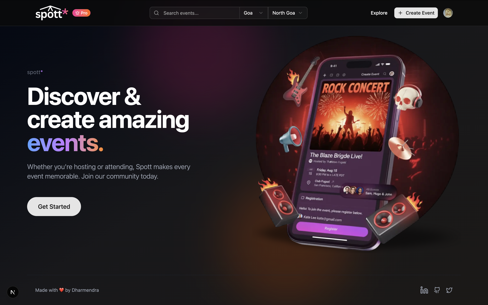
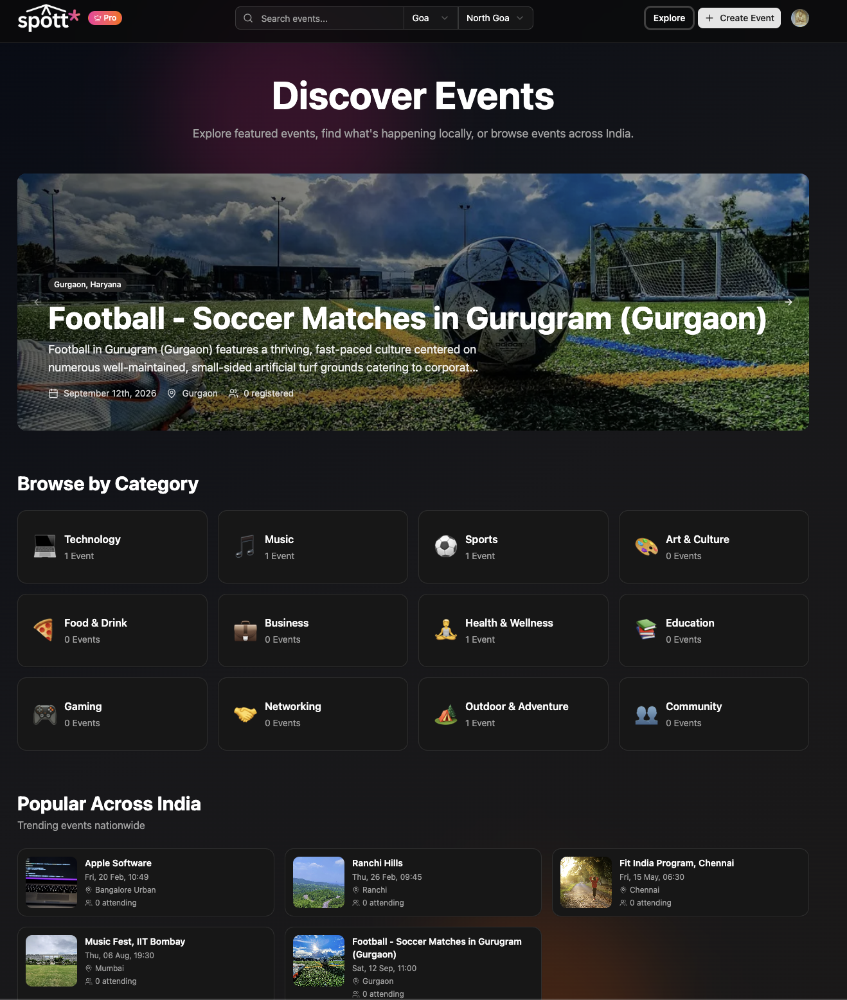

# AI Events Organiser

**Full Stack React Project using Next.js, Tailwind CSS, Shadcn UI, and Mobbin.**
Build and manage events efficiently with AI-powered features.

<p align="center">
  
  
  <a href="LICENSE">
    
  </a>
</p>

<p align="center">
  <a href="https://ai-events-organiser-nleynd8jd-justdk06s-projects.vercel.app/">🌐 Live Demo</a> •
  <a href="https://github.com/Dharmendra-07/AI-Events-Organiser">📦 GitHub Repo</a>
</p>

---

## Table of Contents

* [Project Overview](#project-overview)
* [Features](#features)
* [Tech Stack](#tech-stack)
* [Installation](#installation)
* [Project Structure](#project-structure)
* [Screenshots](#screenshots)
* [Usage](#usage)
* [Contributing](#contributing)

---

## Project Overview

AI Events Organiser is a full-stack web application for managing events with advanced AI-powered functionalities. Users can create, explore, register for events, and handle ticketing and subscriptions with ease.

The project demonstrates integration of frontend design (Next.js, Tailwind CSS, Shadcn UI) with backend operations, user authentication, database interactions, and AI code/event review flows.

---

## Features

* Next.js + Tailwind + Shadcn UI integration
* AI-powered event creation and code review
* User authentication and protected routes
* Event browsing and detailed view
* User subscriptions and pricing plans
* Ticketing and event registration
* Admin dashboard for event management
* Database design with relational schema
* Custom hooks for API query and mutation

---

## Tech Stack

* **Frontend:** Next.js, Tailwind CSS, Shadcn UI, Mobbin
* **Backend:** Node.js, Prisma ORM
* **Database:** PostgreSQL / MySQL (adjust as needed)
* **AI Features:** AI code review, AI event suggestions
* **Deployment:** Vercel

---

## Installation

1. Clone the repository:

```bash
git clone https://github.com/Dharmendra-07/ai-events-organiser.git
```

2. Install dependencies:

```bash
cd ai-events-organiser
npm install
```

3. Setup environment variables:
   Create a `.env` file and add:

```env
DATABASE_URL=your_database_url
NEXTAUTH_SECRET=your_secret
```

4. Run migrations and seed database:

```bash
npx prisma migrate dev
```

5. Start the development server:

```bash
npm run dev
```

6. Open [http://localhost:3000](http://localhost:3000) in your browser

---

## Project Structure

```
/app
  /components
  /hooks
  /layouts
  /pages
  /styles
/prisma
  schema.prisma
/public
  /images
```

---

## Screenshots

### Dashboard


*(Replace the path with your actual dashboard screenshot in the `public/images` folder)*

---

### Landing Page



### Explore Events



### Event Detail


---

## Usage

* Users can sign up or log in
* Explore events and register for them
* Use AI tools for code or event review
* Manage your events from the dashboard
* Track tickets and subscriptions

---

## Contributing

1. Fork the repository
2. Create your feature branch (`git checkout -b feature/YourFeature`)
3. Commit your changes (`git commit -m 'Add feature'`)
4. Push to the branch (`git push origin feature/YourFeature`)
5. Open a Pull Request

---

I can also **create a ready-to-use dashboard image section** with placeholders for your screenshots, so it looks professional in GitHub.

Do you want me to generate that enhanced screenshot section for the README?


### Make sure to create a `.env` file with following variables -

```
# Deployment used by `npx convex dev`
CONVEX_DEPLOYMENT=

NEXT_PUBLIC_CONVEX_URL=

NEXT_PUBLIC_CLERK_PUBLISHABLE_KEY=
CLERK_SECRET_KEY=

NEXT_PUBLIC_CLERK_SIGN_IN_URL=/sign-in
NEXT_PUBLIC_CLERK_SIGN_UP_URL=/sign-up

CLERK_JWT_ISSUER_DOMAIN=

NEXT_PUBLIC_UNSPLASH_ACCESS_KEY=

GEMINI_API_KEY=
```
https://curious-mantis-7.clerk.accounts.dev

https://curious-mantis-7.clerk.accounts.dev/.well-known/jwks.json